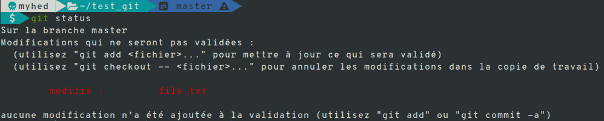
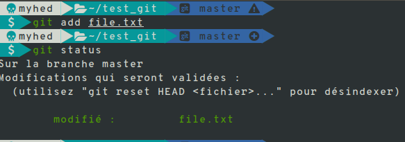
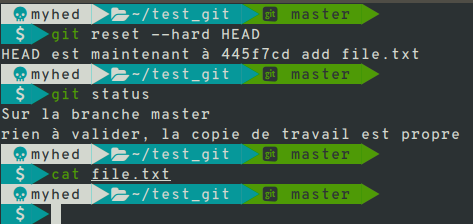

# Init project

this tutorial can improve your skills on git if you are new on this technologies.

for this tutorial we will handle git on the command line.

Let's start if you want to continue the tutorial you will need to create one folder named **git_practice**, after this go into the folder created, to access it type the following command in the terminal.

```sh
    cd git_practice/
```
Well now we are on the folder we need to initialize a git folder you can do this with that command
```
    git init
```
if you get a succesffulled command when you type normally

```bash
    ls -a 
```
you get at the screen one folder named **.git**
## Git Command
### Reset Command
```
    git reset options [--hard,--mixed,--soft]
```
* **--hard options**: erase all changes you have made, unstage all files and move the head to the commit (if you specify the hash commit) in the project.

To test this command we going to create a file named **file.txt** at **git_practice** folder created before and we will write into it and add that change in staged state. **<span style="color:red">important</span>** you don't commit change juste keep it locally

that will print you at the screen


as we can see on this picture we are on the unstaged state to passe on the staged state type

```
    git add file.text
```
and you will see



now we have one change it's ready to test command options --hard

```
git reset --hard HEAD
```

after this command we have lost all change we have made on the file.txt

